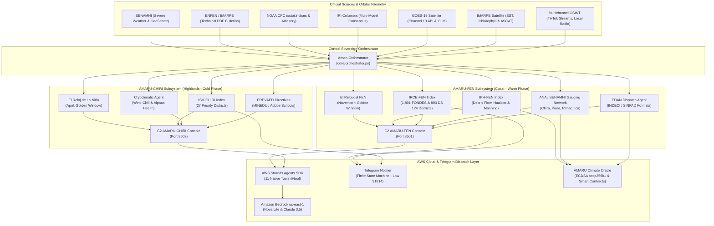

# AMARU SYSTEM: AMARU-FEN 🌊🇵🇪 & AMARU-CHIRI ❄️🇵🇪
### Sovereign Multi-Agent Tactical Command & Control (C2) Platform & Anticipatory Governance for Climate Extremes
Intelligent Operations Center for Early Action, Hydroclimatic & Cryoclimatic Resilience, EDAN Disaster Dispatch, and Multichannel Telemetry

> 🌐 **Languages / Idiomas:** **[ 🇬🇧 English Version (Official) ](README.md)** | [ 🇵🇪 Versión en Español ](README_ES.md)

[](#)
[](https://innovation.wfp.org/)
[](https://www.mef.gob.pe/)
[](https://agentsforhumans.devpost.com/)
[](https://aws.amazon.com/bedrock/)
[-blueviolet)](https://ieee-climatechain-hack.devpost.com/)
[](#)
[](#)
[](https://www.python.org/)
[-success)](#)
[](#)
[](https://telegram.org/)
[](#)
[](#)

---

## 🎯 Executive Summary

The **AMARU System** is a high-fidelity scientific and technological platform (**TRL 7**) engineered to transform disaster risk management across Peru and Latin America, transitioning from an inefficient, reactive post-disaster model to an **Anticipatory Governance Framework (CAF / PUCP 2026 / WFP AFCIA 2026)** driven by physical hydrodynamic models and deterministic Artificial Intelligence multi-agent swarms.

The platform implements a **dual decoupled architecture** addressing both critical extremes of the ENSO (El Niño-Southern Oscillation) cycle:

1. **AMARU-FEN (North & Central Pacific Coast - Warm Phase El Niño):**
   * Early prevention, nowcasting, and tactical response against warm Kelvin waves, torrential river surges, and flash floods (huaicos).
   * Real-time monitoring and computation of the **IRCE-FEN** and **IPH-FEN** indices across the **893 official districts under Supreme Decree Nº 124-2026-PCM** and the comprehensive master baseline of **1,891 national FONDES districts (Supreme Decree Nº 234-2025-EF)**.
   * **El Reloj del FEN:** 360° tactical polar clock with its **November Golden Window** for preventative river desilting and civil engineering reinforcement prior to summer rainfall.
2. **AMARU-CHIRI (Southern Andes & High Altiplano - Cold Phase La Niña):**
   * Cryoclimatic vigilance against cold Kelvin waves, intensified trade winds, and nocturnal thermal plunges ($<-15^\circ\text{C}$ to $-25^\circ\text{C}$).
   * Continuous computation of the **ISH-CHIRI** index across **27 prioritized high-vulnerability Andean districts** (Mazocruz, Ananea, Capazo, San Antonio de Putina, etc.).
   * **El Reloj de La Niña:** 360° polar clock with a 90° glacial danger arc (May–July) and its strategic **April Golden Window** for alpaca herd vaccination, emergency forage stockpiling, and thermal conditioning of rural adobe schools under national **PREVAED (PP-0068)** and **Multi-Sectoral Frost & Freeze Plan (Supreme Decree Nº 122-2024-PCM)** guidelines.

---

## ⚖️ Guiding Principle: Human Sovereignty & Continuous Oversight (Peru AI Law Nº 31814)

> [!IMPORTANT]
> **STRICT COMPLIANCE WITH PERUVIAN LAW Nº 31814, UNESCO (2021) RECOMMENDATIONS & SENDAI FRAMEWORK:**  
> **The AMARU System and its AI agents DO NOT make autonomous executive decisions.**  
> The platform operates strictly as a **Technical Decision Support System (DSS)**. No AI component holds executive, budgetary, contracting, or punitive authority. The ultimate decision to order a population evacuation (SISMATE), authorize Emergency Direct Contracting (D.S. Nº 124-2026-PCM), disburse public disaster funds (Program Budget PP 0068 / FONDES), or sign an official EDAN damage assessment sheet rests **solely, exclusively, and indelegably with competent human authorities** (Mayors, Regional Governors, Government Ministers, the Director of COEN, and the Head of INDECI).  
> **Human Sovereignty is the foundational and unshakeable pillar of the entire system.**

---

## 🏛️ Legal Disclaimer & Trademark Notice (Nominative Fair Use)

> [!CAUTION]
> ### 1. Express Declaration of Non-Affiliation with Public Entities
> The **AMARU System** (comprising **AMARU-FEN** and **AMARU-CHIRI**) is an independent software, technological innovation, and private research initiative developed by **MERCADOS PLAZA DEL PERU S.A.C.**.  
> **AMARU is NOT a public agency, government body, or official branch of the Peruvian Government.** It does not form part of the organic structure of the National Disaster Risk Management System (SINAGERD), the National Civil Defense Institute (INDECI), the National Center for Estimation, Prevention and Disaster Risk Reduction (CENEPRED), or any ministry, regional government, or municipality.
> 
> ### 2. Nominative Fair Use of Third-Party Trademarks & Official Data Sources
> References, citations of supreme decrees, acronyms, or links to public agencies and scientific institutions (such as **SENAMHI, ANA, IGP, IMARPE, ENFEN, INDECI, CENEPRED, MEF, MINEDU, PCM, NOAA, WMO, WFP / UN, CAF, PUCP, UP**, among others), as well as to third-party technology platforms (such as **Telegram, Amazon Web Services - AWS, Amazon Bedrock, Google Cloud, Python, Streamlit, Ethereum, GitHub**, among others), are made **solely and exclusively for technical, informative, descriptive, open data interoperability, and scientific benchmarking purposes (Nominative Fair Use)**.  
> 
> In no event do such references imply endorsement, official sponsorship, corporate affiliation, or appropriation of intellectual or industrial property rights by the developers or the holding company. **All trademarks, institutional names, logos, and copyrights belong solely and exclusively to their respective lawful owners.**
> 
> ### 3. Informative Nature and Operational Liability Limitation
> Numerical calculations, hydrodynamic models, indices (`IPH-FEN`, `IRCE-FEN`, `ISH-CHIRI`), pericial reports, or automated alerts generated by the system represent analytical decision-support projections. They do not replace official bulletins, meteorological warnings, or binding directives issued by competent government authorities.

---

## 🏛️ Dual System Architecture



---

## ⏰ Tactical Polar Clocks & Logistics Golden Windows

### 1. El Reloj del FEN (Pacific Coast & Lowlands)
* **360° Polar Dial:** 12 chronological hours representing the 12 months of the year.
* **Red Threat Arc:** December to March sector ($90^\circ$ angular amplitude) with a 7-tone thermal gradient.
* **Kinetic Hand:** Advances autonomously driven by positive sea surface temperature (SST) anomalies in the Niño 1+2 region ($> +1.5^\circ\text{C}$ up to $+4.1^\circ\text{C}$).
* **Historical Analogues:** FEN 1982-1983, FEN 1997-1998, and Cyclone Yaku (2023).
* **November Golden Window:** Critical operational deadline for executing river channel desilting, riprap reinforcement on urban riverbanks, and rustic canal intake defenses before summer rains begin.

### 2. El Reloj de La Niña (Southern Andes & High Altiplano)
* **C2 Calibrated Geometry:** Polar origin at $(cx=260.0, cy=260.0)$ with outer radius $r=247.0$.
* **Glacial Threat Arc:** May to July sector ($90^\circ$) featuring three concentric radial tracks labeled in solid black (`#000000`, `font-weight: 900`) for high-contrast visibility on dark emergency room C2 monitors.
* **Tactical Yellow Sector of the Golden Window (April):**  
  April is highlighted in tactical yellow (`#facc15`), border highlight (`#fef08a`), and perimeter badge `ABR★`.
* **Logistics Doctrine for April:**  
  Mandatory milestone for:
  1. Deworming and vitamin supplementation of pregnant alpaca dams before extreme cold suppresses immune response.
  2. Stockpiling and dry distribution of alfalfa hay bales in Agro Rural community shelters (*tambos*).
  3. Thermal insulation of rural schools and PREVAED calendar adjustments.
* **Historical Analogues:** La Niña 1988-1989 and La Niña 2007-2008.

---

## 📱 Real-Time Telegram Notifier (Law Nº 31814 AI Labeling)

The automated notification engine ([`core/telegram_notifier.py`](core/telegram_notifier.py)) tracks real-time territorial risk transitions by UBIGEO district code:

* **Anti-Spam Finite State Machine:** Dispatches immediate notifications **only upon true state transitions to RED ALERT (Critical FEN)** or **GLACIAL RED ALERT (CHIRI)**, eliminating alert fatigue.
* **Mandatory AI Transparency Labeling (Law Nº 31814):**
  ```
  🚨 CRITICAL RED ALERT — AMARU-FEN / CHIRI SYSTEM 🚨
  ━━━━━━━━━━━━━━━━━━━━━━━━━━━━━━━━━━━━
  🤖 [OFFICIAL NOTICE: REPORT GENERATED BY ARTIFICIAL INTELLIGENCE]
  Autonomously generated by the AMARU AI Engine under Peruvian Law Nº 31814 (Human Sovereignty & Algorithmic Transparency).
  ━━━━━━━━━━━━━━━━━━━━━━━━━━━━━━━━━━━━
  ```
* **Directives & Human Sovereignty Clause:** Breaks down calculated physical parameters (Manning shear stress, Kirpich lag time, nocturnal radiation loss), legal enablement decrees (D.S. Nº 124-2026-PCM / D.S. Nº 122-2024-PCM), and explicitly ratifies that competent human authorities retain exclusive command over evacuations and public funds.

---

## ☁️ AWS Bedrock & AWS Strands Agents SDK Integration

For the **AWS Agents for Humans Hackathon (Track: Good Neighbor Agents)**, AMARU interfaces with foundation models in `us-east-1` via cross-region inference profiles:

* **Connected Models:**
  * `us.amazon.nova-lite-v1:0` (Amazon Nova Lite for ultra-low latency triage and rapid synthesis).
  * `us.anthropic.claude-3-haiku-20240307-v1:0` (Claude 3 Haiku for complex normative and causal reasoning).
* **11 Native Packaged Tools (`@tool`):**
  1. `monitorear_hidrometria_senamhi`: Rainfall and river gauge threshold detection.
  2. `evaluar_georriesgo_quebradas`: Cross-referencing weather warnings with alluvial fans and dikes.
  3. `consultar_memoria_historica_desastres`: Querying 1983, 1998, and 2017 historical disaster baselines.
  4. `auditar_marco_legal_decretos`: Legal verification in Supreme Decree Nº 124-2026-PCM.
  5. `rastrear_reportes_ciudadanos_osint`: Real-time citizen reports across TikTok and community radio.
  6. `despachar_ficha_oficial_edan`: Pre-populating official INDECI / SINPAD damage sheets.
  7. `contencion_voz_y_alerta_vapi`: 24/7 phone triage and emotional stabilization for trapped persons.
  8. `anclar_socorro_climatico_web3`: secp256k1 cryptographic signing of parametric relief smart contracts.
  9. `evaluar_resiliencia_comunitaria_distrito`: Holistic community resilience assessment.
  10. `evaluar_crioclima_heladas_nina`: Cryoclimatic monitoring of frosts, alpacas, and PREVAED.
  11. `consultar_reloj_tactico_nina`: Querying the polar clock state and April Golden Window.
* **Security & Fallback:** Local IAM credentials protected via `.env` with seamless offline buffering when satellite connection is severed.

---

## 🚀 Quickstart & Installation

### 1. Requirements & Setup
```bash
# Clone repository
git clone https://github.com/carlosmba12Peru/amaru-climate.git
cd amaru-climate

# Create virtual environment and install dependencies
python -m venv .venv
.venv\Scripts\activate       # On Windows
# source .venv/bin/activate  # On Linux/macOS

pip install -r requirements.txt
```

### 2. Configure Environment Variables (`.env`)
```bash
cp .env.example .env
# Edit .env with your optional credentials:
# AWS_ACCESS_KEY_ID=...
# AWS_SECRET_ACCESS_KEY=...
# AWS_DEFAULT_REGION=us-east-1
# TELEGRAM_BOT_TOKEN=...
# TELEGRAM_CHAT_ID=...
```

### 3. Launch Tactical C2 Consoles
```bash
# Terminal 1: Tactical C2 Console AMARU-FEN (Coast / Floods) on Port 8501
streamlit run ui/app_amaru.py --server.port=8501

# Terminal 2: Cryoclimatic C2 Console AMARU-CHIRI (Highlands / Frosts) on Port 8502
streamlit run ui/app_nina.py --server.port=8502
```
* **AMARU-FEN Dashboard:** Open `http://localhost:8501`
* **AMARU-CHIRI Dashboard:** Open `http://localhost:8502`
* **Interactive Standalone Polar Clock:** Open `visor_reloj_chiri.html` in any modern browser.

---

## 🧪 Automated Test Suite

AMARU includes a comprehensive suite of **167 automated unit and integration tests passing with 100% success rate**:

```bash
# Run the complete test suite (167 tests)
python -m pytest -v

# AWS Strands Agents SDK Adapter tests (12 tests)
python -m pytest tests/test_amaru_strands_agent.py -v

# Real-time Telegram Notifier & Law Nº 31814 tests (4 tests)
python -m pytest tests/test_telegram_notifier.py -v

# Reloj de La Niña & April Golden Window tests (18 tests)
python -m pytest tests/test_reloj_nina.py tests/test_reloj_nina_actualizacion_datos.py -v

# Reloj del FEN tests (6 tests)
python -m pytest tests/test_reloj_fen.py -v

# Cryptographic SHA-256 Tamper-Proofing & Web3 Oracle tests (10 tests)
python -m pytest tests/test_blindaje_criptografico_iph_fen.py tests/test_blockchain_oracle.py -v
```

---

## 📁 Repository Structure

```
amaru-climate/
├── agents/                           # Specialized Autonomous Multi-Agent Swarm
│   ├── agente_memoria_historica.py   # Historical memory: FEN 1998, 2017, ENFEN Nº 15, SENAMHI 97-98 & IGP
│   ├── agente_legal_normativo.py     # Legal compliance: 1,891 FONDES districts, 893 DS 124 & Law 31814
│   ├── agente_senamhi.py             # Meteorological sentry, warnings & 24h flash flood telemetry
│   ├── agente_georriesgo.py          # Georisk, SHA-256 locked IPH-FEN, Manning & alluvial cones
│   ├── agente_vigia_osint.py         # OSINT citizen monitoring across live streams & community radio
│   ├── agente_voz_vapi.py            # 24/7 rescue triage and emotional voice containment
│   ├── agente_despacho_edan.py       # Official INDECI / SINPAD damage sheet generation
│   ├── agente_crioclimatico_nina.py  # AMARU-CHIRI cryoclimatic agent (Frosts, Wind-Chill, Alpacas)
│   └── amaru_strands_agent.py        # Official AWS Strands Agents SDK adapter (11 native tools @tool)
├── contracts/                        # Smart Contracts for IEEE ClimateChain 2026 / COP31
│   └── ParametricClimateRelief.sol   # Parametric disaster relief disbursement & EDAN proof anchoring
├── core/                             # Algorithmic Core, Hydrodynamics, C2 Orchestrator
│   ├── orchestrator.py               # Central AMARU orchestrator (Dual FEN + CHIRI)
│   ├── reloj_fen.py                  # El Reloj del FEN: Polar tactical clock & November Golden Window
│   ├── reloj_nina.py                 # El Reloj de La Niña: Polar tactical clock & April Golden Window
│   ├── telegram_notifier.py          # Real-time Telegram alert dispatcher (Law Nº 31814)
│   ├── modulo_satelite_edan_cgr.py   # Satellite EDAN pre-population service with CGR anti-corruption audits
│   ├── climate_oracle_web3.py        # AMARU Climate Oracle: ECDSA secp256k1 signatures & EVM attestations
│   ├── motor_chat_soberano.py        # Sovereign C2 chat assistant with doctrine routing
│   ├── motor_lenguas_originarias.py  # Multilingual indigenous language engine (Quechua, Aymara, Awajún)
│   ├── conector_igp_lahares.py       # Integration with IGP seismic-volcanic network & lahar hazards
│   ├── anticipatory_triggers.py      # CAF / PUCP anticipatory financing triggers & pre-positioning
│   ├── conector_open_meteo.py        # Open-Meteo telemetry connector (ECMWF / GFS ensemble)
│   ├── gestor_historico_sincronizaciones.py # C2 snapshots & Delta traffic light tracking
│   ├── registro_fuentes_validadas.py # Sovereign Allowlist security manager
│   ├── edge_resilience.py            # Off-Grid resilience handler & local disaster buffer
│   ├── alerta_defensa_civil.py       # Civil Defense email & municipal alert dispatcher
│   ├── consola_c2.py                 # Interactive tactical C2 terminal
│   └── ingestor_oficial.py           # Official ingestor: SENAMHI, ENFEN, NOAA, IRI, El Niño Live
├── data/                             # Knowledge Bases, Geospatial Data & Catalogs
│   ├── distritos_riesgo_nacional_1891_cenepred_mef.json # National 1,891 FONDES districts (DS 234-2025-EF)
│   ├── geodatos_893_distritos_ubigeo.json # EPSG:4326 geodesic base for 893 emergency districts
│   ├── distritos_emergencia_ds_124_2026_pcm.json # Official 893 districts under DS 124-2026-PCM
│   ├── catalogo_distritos_heladas_nina.json # High-vulnerability Andean frost catalog
│   ├── catalogo_quebradas_criticas.json # Homologated critical alluvial streams catalog
│   ├── fuentes_validadas_amaru.json  # Audited allowlist of 16 authorized scientific sources
│   ├── historico_sincronizaciones_c2.json # Historical C2 synchronization delta log
│   ├── estaciones_hidrologicas_aforo.json # ANA/SENAMHI gauging network (m³/s flows and thresholds)
│   └── ... (Historical records: ENFEN Nº 15, SENAMHI 1997-1998, NOAA CPC)
├── docs/                             # Official Technical Documentation & WFP Deliverables
│   ├── AMARU_Pitch_Deck_WFP_AFCIA_EN.pdf # Official 10-Slide Pitch Deck (WFP AFCIA LAC 2026)
│   ├── ficha_tecnica_nodos_iot_amaru.md # Non-Invasive Ultrasonic IoT Telemetry Specifications
│   └── ficha_tecnica_nodos_iot_amaru.pdf # High-Resolution Hardware Spec Sheet PDF
├── tests/                            # 167 automated pytest tests (167/167 passing - 100%)
├── ui/                               # Interactive Streamlit Tactical Consoles
│   ├── app_amaru.py                  # Tactical Command Center AMARU-FEN (Port 8501)
│   └── app_nina.py                   # Cryoclimatic Command Center AMARU-CHIRI (Port 8502)
├── visor_reloj_chiri.html            # Standalone C2 tactical polar clock viewer
└── requirements.txt
```

---

## 📜 License & Ownership

**Proprietary Innovation & Sovereign IP:** Developed independently as an autonomous private climate technology venture by **MERCADOS PLAZA DEL PERU S.A.C.** (where lead software architect **Carlos Baños Díaz** holds 95% majority controlling equity) and zero institutional encumbrances.

Methodological frameworks draw scientific inspiration from public domain research published by the Instituto Geofísico del Perú (IGP), official bulletins from the Multisectoral ENFEN Commission, the National Multi-Sectoral Frost and Freeze Plan (D.S. Nº 122-2024-PCM), and the global Anticipatory Governance doctrine (CAF / WFP 2026).

Licensed under the **Apache License, Version 2.0**.
