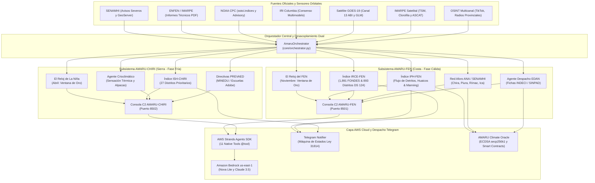

# SISTEMA AMARU: AMARU-FEN 🌊🇵🇪 & AMARU-CHIRI ❄️🇵🇪
### Plataforma Multi-Agente Soberana de Mando y Control Táctico (C2) & Gobernanza Anticipatoria ante Extremos Climáticos
Centro de Operaciones Inteligente para la Acción Temprana, Resiliencia Hidroclimática/Crioclimática, Despacho EDAN y Telemetría Multicanal

> 🌐 **Idiomas / Languages:** [ 🇬🇧 Read in English (Official) ](README.md) | **[ 🇵🇪 Versión en Español ](README_ES.md)**


[](#)
[](https://innovation.wfp.org/)
[](https://www.mef.gob.pe/)
[](https://agentsforhumans.devpost.com/)
[](https://aws.amazon.com/bedrock/)
[-blueviolet)](https://ieee-climatechain-hack.devpost.com/)
[](#)
[](#)
[](https://www.python.org/)
[-success)](#)
[](#)
[](https://telegram.org/)
[](#)
[](#)

---

## 🎯 Resumen Ejecutivo

El **Sistema AMARU** es una plataforma científica y tecnológica de alta fidelidad (**TRL 7**) diseñada para transformar la gestión del riesgo de desastres en el Perú, transitando de un modelo reactivo e ineficiente a una **Gobernanza y Acción Anticipatoria (Marco de Sendai / CAF)** basada en datos y agentes determinísticos de Inteligencia Artificial.

El sistema implementa una **arquitectura dual desacoplada** que cubre los dos extremos climáticos críticos del territorio peruano:

1. **AMARU-FEN (Costa Norte y Central - Fase Cálida El Niño):**
   * Prevención, nowcasting y respuesta táctica ante ondas Kelvin cálidas, crecidas fluviales y activación de quebradas.
   * Monitoreo y cálculo del índice **IRCE-FEN** para los **893 distritos oficiales del D.S. Nº 124-2026-PCM** y cruce con los **1,891 distritos FONDES (D.S. Nº 234-2025-EF)**.
   * **El Reloj del FEN:** Cronómetro polar con su **Ventana de Oro en Noviembre** para obras preventivas de descolmatación antes del periodo pluvial.
2. **AMARU-CHIRI (Sierra Sur y Altiplano - Fase Fría La Niña):**
   * Vigilancia crioclimática ante ondas Kelvin frías, intensificación de vientos alisios y desplomes térmicos nocturnos ($<-15^\circ\text{C}$ a $-25^\circ\text{C}$).
   * Monitoreo del índice **ISH-CHIRI** sobre **27 distritos de muy alta vulnerabilidad** (Mazocruz, Ananea, Capazo, San Antonio de Putina, etc.).
   * **El Reloj de La Niña:** Cronómetro polar de $360^\circ$ con arco glacial de $90^\circ$ (Mayo-Julio) y su **Ventana de Oro en Abril** para vacunación alpaquera, distribución de forraje y adecuación de escuelas rurales bajo directivas **PREVAED (PP-0068)** y el **Plan Multisectorial ante Heladas y Friaje (D.S. Nº 122-2024-PCM)**.

---

## ⚖️ Principio Rector: Soberanía Humana y Supervisión Permanente (Ley Nº 31814)

> [!IMPORTANT]
> **CUMPLIMIENTO ESTRICTO DE LA LEY Nº 31814, UNESCO (2021) Y MARCO DE SENDAI:**  
> **El Sistema AMARU y sus agentes de Inteligencia Artificial NO toman decisiones de forma autónoma.**  
> La plataforma opera estrictamente como un **Sistema de Soporte a la Decisión Técnica (DSS)**. Ninguna IA tiene facultades ejecutivas, presupuestales, contractuales ni punitivas. La decisión final sobre evacuar una población (SISMATE), autorizar una Contratación Directa por Emergencia (D.S. Nº 124-2026-PCM), desembolsar fondos públicos (PP 0068) o suscribir una Ficha EDAN corresponde **única, exclusiva e indelegablemente a las autoridades humanas competentes** (Alcaldes, Gobernadores Regionales, Ministros de Estado, Director del COEN y Jefe de INDECI).  
> **La Soberanía Humana es el principio rector inquebrantable de todo el sistema.**

---

## 🏛️ Descargo de Responsabilidad Legal y Uso de Marcas (Disclaimer)

> [!CAUTION]
> ### 1. Declaración Expresa de No Afiliación Estatal
> El **Sistema AMARU** (que comprende **AMARU-FEN** y **AMARU-CHIRI**) es una plataforma de software, innovación tecnológica e investigación privada desarrollada por **MERCADOS PLAZA DEL PERU S.A.C.**.  
> **AMARU NO es una entidad pública, organismo gubernamental, ni dependencia oficial del Estado Peruano.** No forma parte orgánica del Sistema Nacional de Gestión del Riesgo de Desastres (SINAGERD), del Instituto Nacional de Defensa Civil (INDECI), del Centro Nacional de Estimación, Prevención y Reducción del Riesgo de Desastres (CENEPRED) ni de ningún ministerio, gobierno regional o municipalidad.
> 
> ### 2. Uso Legítimo y Referencial de Marcas y Fuentes Oficiales (Nominative Fair Use)
> Las referencias, citas de decretos supremos, acrónimos o enlaces a organismos públicos e instituciones científicas (tales como **SENAMHI, ANA, IGP, IMARPE, ENFEN, INDECI, CENEPRED, MEF, MINEDU, PCM, NOAA, WMO, WFP / ONU, CAF, PUCP, UP**, entre otras), así como a plataformas tecnológicas de terceros (tales como **Telegram, Amazon Web Services - AWS, Amazon Bedrock, Google Cloud, Python, Streamlit, Ethereum, GitHub**, entre otras), se realizan **única y exclusivamente con fines técnicos, informativos, descriptivos, de interoperabilidad con fuentes de datos públicos abiertos y rigor metodológico (Uso Nominativo / Fair Use)**.  
> 
> En ningún caso dichas referencias implican patrocinio, aval, endoso oficial, asociación societaria o apropiación de signos distintivos por parte de los desarrolladores o de la empresa titular. **Todas las marcas registradas, nombres institucionales, logotipos y derechos de autor pertenecen única y exclusivamente a sus respectivos titulares legítimos.**
> 
> ### 3. Carácter Informativo y Ausencia de Responsabilidad Operativa
> Los cálculos, modelos numéricos, índices (`IPH-FEN`, `IRCE-FEN`, `ISH-CHIRI`), reportes periciales o alertas generadas por el sistema constituyen proyecciones analíticas orientativas y no reemplazan bajo ninguna circunstancia los boletines, avisos meteorológicos y directivas oficiales emitidas por las autoridades estatales competentes. Los operadores, instituciones o usuarios que utilicen el sistema asumen la responsabilidad técnica de su empleo.

---

## 🏛️ Arquitectura del Sistema Dual AMARU



---

## ⏰ Los Cronómetros Polares Tácticos y las Ventanas de Oro Logísticas

### 1. El Reloj del FEN (Costa Norte y Central)
* **Dial Polar de 360°:** 12 horas equivalentes a los 12 meses del año.
* **Arco Rojo de Amenaza:** Sector de Diciembre a Marzo ($90^\circ$ de amplitud angular) con gradiente térmico de 7 tonos.
* **Minutero Cinético:** Se adelanta ante anomalías marinas positivas en Niño 1+2 ($> +1.5^\circ\text{C}$ a $+4.1^\circ\text{C}$).
* **Años Análogos Históricos:** FEN 1982-1983 y FEN 1997-1998.
* **Ventana de Oro en Noviembre:** Último mes táctico para ejecutar descolmataciones de cauces, reforzamiento de diques en fajas marginales urbanas y defensas ribereñas antes de las lluvias de verano.

### 2. El Reloj de La Niña (Sierra Sur y Altiplano)
* **Geometría Calibrada C2:** Centro polar en $(cx=260.0, cy=260.0)$ con radio exterior $r=247.0$.
* **Arco Glacial de Amenaza:** Sector de Mayo a Julio ($90^\circ$) en gradiente cian/azul polar con tres pistas concéntricas rotuladas en **negro puro sólido (`#000000`, `font-weight: 900`)** para máximo contraste en monitores oscuros de Sala de Situación C2.
* **Sector Táctico Amarillo de la Ventana de Oro (Abril):**  
  El mes de Abril se proyecta con fondo amarillo táctico (`#facc15`), filete de resalte (`#fef08a`) y marca perimétrica destacada `ABR★`.
* **Doctrina Logística de Abril:**  
  Hito mandatorio para:
  1. Vacunación y desparasitación del ganado alpaquero gestante antes de que el frío debilite su sistema inmune.
  2. Distribución de pacas de forraje y vitaminas en tambos comunales de Agro Rural.
  3. Acondicionamiento térmico de escuelas rurales y suspensión programada PREVAED.
* **Años Análogos:** La Niña 1988-1989 y La Niña 2007-2008.

---

## 📱 Notificador Automatizado Telegram con Cumplimiento Ley Nº 31814

El motor [`core/telegram_notifier.py`](core/telegram_notifier.py) monitorea en tiempo real las transiciones de riesgo por código UBIGEO:

* **Máquina de Estados Finita Anti-Spam:** Solo despacha alertas ante transiciones efectivas hacia **ALERTA ROJA (Crítico FEN)** o **ALERTA ROJA GLACIAL (CHIRI)**, evitando la fatiga de alertas.
* **Rotulado Legal Mandatorio (Ley Nº 31814):**
  ```
  🚨 ALERTA ROJA INMINENTE — SISTEMA AMARU-FEN / CHIRI 🚨
  ━━━━━━━━━━━━━━━━━━━━━━━━━━━━━━━━━━━━
  🤖 [AVISO OFICIAL: REPORTE ELABORADO POR INTELIGENCIA ARTIFICIAL]
  Elaborado autónomamente por el Motor de IA AMARU bajo el marco de la Ley Nº 31814 (Transparencia y Soberanía Humana).
  ━━━━━━━━━━━━━━━━━━━━━━━━━━━━━━━━━━━━
  ```
* **Directivas Ejecutivas y Cláusula de Soberanía Humana:** Desglosa parámetros físicos calculados, citas de decretos habilitantes (D.S. Nº 124-2026-PCM / D.S. Nº 122-2024-PCM) y ratifica que la autoridad humana retiene la potestad exclusiva de evacuación y ejecución.

---

## ☁️ Integración AWS Bedrock & AWS Strands Agents SDK

Para el certamen **AWS Agents for Humans Hackathon (Track: Good Neighbor Agents)**, el sistema integra modelos de frontera en la región `us-east-1` utilizando perfiles de inferencia cross-region:

* **Modelos Conectados:**
  * `us.amazon.nova-lite-v1:0` (Amazon Nova Lite para triaje y respuesta de ultrabaja latencia).
  * `us.anthropic.claude-3-haiku-20240307-v1:0` (Claude 3 Haiku para razonamiento causal y normativo).
* **11 Herramientas Nativas (`@tool`) Empaquetadas:**
  1. `monitorear_hidrometria_senamhi`: Detección de umbrales pluviométricos y crecidas fluviales.
  2. `evaluar_georriesgo_quebradas`: Cruce de avisos con conos aluviales y diques críticos.
  3. `consultar_memoria_historica_desastres`: Antecedentes de 1983, 1998 y 2017.
  4. `auditar_marco_legal_decretos`: Verificación en D.S. Nº 124-2026-PCM.
  5. `rastrear_reportes_ciudadanos_osint`: Análisis de TikTok Lives y radios comunitarias.
  6. `despachar_ficha_oficial_edan`: Prellenado de ficha INDECI / SINPAD.
  7. `contencion_voz_y_alerta_vapi`: Triaje telefónico de personas atrapadas con contención emocional.
  8. `anclar_socorro_climatico_web3`: Firma secp256k1 de atestados climáticos para contratos paramétricos.
  9. `evaluar_resiliencia_comunitaria_distrito`: Protocolo integral de resiliencia del buen vecino.
  10. `evaluar_crioclima_heladas_nina`: Monitoreo crioclimático de heladas, alpacas y PREVAED.
  11. `consultar_reloj_tactico_nina`: Estado del cronómetro polar de La Niña y Ventana de Oro en Abril.
* **Seguridad de Credenciales:** Claves IAM blindadas localmente en `.env` (ignorado por `.gitignore`) con fallback transparente offline si no hay red satelital.

---

## 🛡️ Cumplimiento de Estándares Internacionales (ISO, NIST, EU AI Act, OMM, OWASP, FIPS)

El Sistema AMARU está diseñado como una plataforma de Soporte a la Decisión Técnica de grado institucional (**TRL 7**), alineado rigurosamente con los marcos globales de Inteligencia Artificial, Reducción del Riesgo de Desastres, Integridad Criptográfica y Ciberseguridad:

| Estándar / Marco | Organismo Emisor | Alcance y Dominio de Gobernanza | Implementación Específica en AMARU |
| :--- | :--- | :--- | :--- |
| **EU AI Act (High-Risk AI)**<br>`Reglamento (UE) 2024/1689` | Unión Europea | IA en Infraestructuras Críticas y Protección Civil (Anexo III, punto 2) | **Supervisión Humana Obligatoria (Art. 14):** Arquitectura DSS no autónoma; **Robustez Técnica y Ciberseguridad (Art. 15):** Cortacircuitos algorítmicos deterministas (`core/circuit_breaker.py`); **Transparencia (Art. 13):** Explicabilidad física mediante hidrodinámica de Manning y termofísica radiativa. |
| **ISO/IEC 42001:2023** | ISO / IEC | Sistema de Gestión de Inteligencia Artificial (AIMS) | Trazabilidad integral del ciclo de vida del dato hidroclimático, auditoría algorítmica continua y orquestación multi-agente desacoplada en `core/orchestrator.py`. |
| **NIST AI RMF 1.0**<br>`NIST SP 1270` | NIST (EE.UU.) | Marco de Gestión de Riesgos de Inteligencia Artificial | Operacionalizado en las 4 funciones: **Govern** (Allowlist en `core/registro_fuentes_validadas.py`), **Map** (Geodatos de 1,891 distritos FONDES), **Measure** (Consistencia Saaty $CR \le 0.10$ en IRCE-FEN), y **Manage** (Máquina de estados anti-fatiga en Telegram). |
| **Marco de Sendai (2015–2030)** | ONU / UNDRR | Reducción del Riesgo de Desastres (Prioridad 4: Acción Temprana) | Operacionaliza las dos **Ventanas de Oro Logísticas**: Noviembre para obras preventivas de descolmatación fluvial (El Niño) y Abril para vacunación alpaquera, forraje y adecuación escolar PREVAED (La Niña). |
| **WMO-No. 558 & WMO-No. 49** | Organización Meteorológica Mundial (OMM/WMO) | Normas Técnicas para Servicios Hidrológicos y Meteorológicos | Control de calidad y estandarización de caudales de aforo ($m^3/s$) y umbrales de precipitación calibrados con ANA/SENAMHI y NOAA CPC. |
| **FIPS 180-4** | NIST (EE.UU.) | Estándar de Hash Seguro (SHA-256) | Sellado criptográfico inmutable de todos los atestados periciales (`IPH-FEN`, `IRCE-FEN`, `ISH-CHIRI`) para resistir auditorías de la Contraloría General de la República (CGR). |
| **IEEE 2418.1 / ISO 23258** | IEEE / ISO | Estándares para Blockchain y Oráculos DLT | Firmas digitales ECDSA secp256k1 en `core/climate_oracle_web3.py` y contratos inteligentes paramétricos automatizados en `contracts/ParametricClimateRelief.sol`. |
| **Ley Nº 31814 & D.S. 085-2024-PCM** | Estado Peruano | Inteligencia Artificial y Soberanía Humana | Rotulado legal mandatorio en cada alerta emitida, ratificando jurídicamente que la potestad de evacuación y ejecución presupuestal recae exclusivamente en la autoridad humana. |
| **OWASP Top 10 for LLM (2025)** | OWASP | Seguridad en Modelos de Lenguaje y Agentes IA | Defensas activas contra Inyección de Prompts (LLM01) y Divulgación de Datos Sensibles (LLM06) mediante sanitización estricta (`core/file_sanitizer.py`) y aislamiento de memoria. |
| **ISO/IEC 27001:2022** | ISO / IEC | Seguridad de la Información y Continuidad Operativa | Resiliencia operativa fuera de línea (*Edge Resilience*) con buffer local (`core/edge_resilience.py`) ante colapso de redes satelitales o eléctricas durante el desastre. |

---

## 🚀 Puesta en Marcha Rápida

### 1. Requisitos e Instalación
```bash
# Clonar y entrar al repositorio
cd lab2

# Crear entorno virtual e instalar dependencias
python -m venv .venv
.venv\Scripts\activate       # En Windows
# source .venv/bin/activate  # En Linux/macOS

pip install -r requirements.txt
```

### 2. Configuración de Credenciales (`.env`)
```bash
cp .env.example .env
# Configurar variables opcionales:
# AWS_ACCESS_KEY_ID=...
# AWS_SECRET_ACCESS_KEY=...
# AWS_DEFAULT_REGION=us-east-1
# TELEGRAM_BOT_TOKEN=...
# TELEGRAM_CHAT_ID=...
```

### 3. Iniciar las Consolas Tácticas C2
```bash
# Terminal 1: Consola Táctica AMARU-FEN (Costa / Inundaciones) en Puerto 8501
streamlit run ui/app_amaru.py --server.port=8501

# Terminal 2: Consola Táctica AMARU-CHIRI (Sierra / Heladas) en Puerto 8502
streamlit run ui/app_nina.py --server.port=8502
```
* **AMARU-FEN:** Acceder a `http://localhost:8501`
* **AMARU-CHIRI:** Acceder a `http://localhost:8502`
* **Visor Polar Standalone C2:** Abrir `visor_reloj_chiri.html` en cualquier navegador.

---

## 🧪 Batería de Pruebas Automatizadas

La suite cuenta con **167 pruebas automatizadas 100% pasando**:

```bash
# Ejecutar la suite completa de pruebas (167 tests)
python -m pytest -v

# Pruebas del Adaptador AWS Strands Agents SDK (12 tests)
python -m pytest tests/test_amaru_strands_agent.py -v

# Pruebas del Notificador Telegram y Ley Nº 31814 (4 tests)
python -m pytest tests/test_telegram_notifier.py -v

# Pruebas del Reloj de La Niña y Ventana de Oro (18 tests)
python -m pytest tests/test_reloj_nina.py tests/test_reloj_nina_actualizacion_datos.py -v

# Pruebas del Reloj del FEN (6 tests)
python -m pytest tests/test_reloj_fen.py -v

# Pruebas de Blindaje Criptográfico y Oráculo Blockchain (10 tests)
python -m pytest tests/test_blindaje_criptografico_iph_fen.py tests/test_blockchain_oracle.py -v
```

---

## 📁 Estructura del Repositorio

```
lab2/
├── agents/                           # Enjambre de Agentes Autónomos Especializados
│   ├── agente_memoria_historica.py   # Oráculo FEN 1998, 2017, ENFEN Nº 15, SENAMHI 97-98 e IGP
│   ├── agente_legal_normativo.py     # Asesor jurídico: 1,891 distritos FONDES, 893 distritos DS 124 y Ley 31814
│   ├── agente_senamhi.py             # Centinela meteorológico, avisos y quebradas 24h
│   ├── agente_georriesgo.py          # Georriesgo, IPH-FEN blindado SHA-256, Manning y conos aluviales
│   ├── agente_vigia_osint.py         # Rastreo ciudadano OSINT en streams y radios comunitarias
│   ├── agente_voz_vapi.py            # Asistente de rescate y triaje de voz 24/7
│   ├── agente_despacho_edan.py       # Formatos oficiales INDECI / SINPAD
│   ├── agente_crioclimatico_nina.py  # Agente crioclimático AMARU-CHIRI (Heladas, Wind-Chill, Alpacas)
│   └── amaru_strands_agent.py        # Adaptador oficial AWS Strands Agents SDK (11 herramientas @tool)
├── contracts/                        # Smart Contracts para IEEE ClimateChain 2026 / COP31
│   └── ParametricClimateRelief.sol   # Desembolso paramétrico (PP 0068) y anclaje Ficha EDAN
├── core/                             # Núcleo Algorítmico, Telemetría y Orquestador C2
│   ├── orchestrator.py               # Orquestador central AMARU (Dual FEN + CHIRI)
│   ├── reloj_fen.py                  # El Reloj del FEN: Cronómetro polar táctico y Ventana de Oro Noviembre
│   ├── reloj_nina.py                 # El Reloj de La Niña: Cronómetro polar táctico y Ventana de Oro Abril
│   ├── telegram_notifier.py          # Despachador de alertas Telegram en tiempo real (Ley Nº 31814)
│   ├── modulo_satelite_edan_cgr.py   # Servicio satélite externo de prellenado EDAN con comité CGR
│   ├── climate_oracle_web3.py        # AMARU Climate Oracle: Firmas ECDSA secp256k1 y atestados EVM
│   ├── motor_chat_soberano.py        # Asistente Soberano C2 multi-audiencia con enrutamiento de doctrina
│   ├── motor_lenguas_originarias.py  # Motor multilingüe (Quechua Chanka/Collao, Aymara, Awajún)
│   ├── conector_igp_lahares.py       # Integración con red sismo-volcánica IGP y lahares
│   ├── anticipatory_triggers.py      # Triggers presupuestales CAF/PUCP y preposicionamiento
│   ├── conector_open_meteo.py        # Conector telemétrico Open-Meteo (ECMWF/GFS ensamble)
│   ├── gestor_historico_sincronizaciones.py # Snapshots C2 y comparativa Delta de semáforos
│   ├── registro_fuentes_validadas.py # Guardián de seguridad de Allowlist Soberana
│   ├── edge_resilience.py            # Manejador de resiliencia Off-Grid y buffer local
│   ├── alerta_defensa_civil.py       # Despachador de correos y alertas municipales
│   ├── consola_c2.py                 # Terminal interactivo de comandos tácticos
│   └── ingestor_oficial.py           # Conector oficial SENAMHI, ENFEN, NOAA, IRI, El Niño Live
├── data/                             # Bases de Conocimiento, Geodatos y Evidencias
│   ├── distritos_riesgo_nacional_1891_cenepred_mef.json # Matriz Nacional 1,891 distritos FONDES (DS 234-2025-EF)
│   ├── geodatos_893_distritos_ubigeo.json # Base geodésica EPSG:4326 de los 893 distritos (Cero Geocoding)
│   ├── distritos_emergencia_ds_124_2026_pcm.json # Los 893 distritos oficiales del DS 124-2026-PCM
│   ├── catalogo_distritos_heladas_nina.json # Catálogo de distritos altoandinos vulnerables a heladas
│   ├── catalogo_quebradas_criticas.json # Catálogo homologado de quebradas críticas
│   ├── fuentes_validadas_amaru.json  # Allowlist de 16 fuentes autorizadas auditadas
│   ├── historico_sincronizaciones_c2.json # Registro histórico y variaciones Delta C2
│   ├── estaciones_hidrologicas_aforo.json # Red telemétrica ANA/SENAMHI (caudales m³/s y umbrales)
│   └── ... (Bases documentales históricas ENFEN Nº 15, SENAMHI 1997-1998, NOAA)
├── docs/                             # Documentación Técnica Oficial y Entregables WFP
│   ├── AMARU_Pitch_Deck_WFP_AFCIA_EN.pdf # Presentación Ejecutiva Oficial (10 slides)
│   ├── ficha_tecnica_nodos_iot_amaru.md # Especificación Nodos IoT Ultrasónicos No Invasivos
│   └── ficha_tecnica_nodos_iot_amaru.pdf # Ficha Técnica en PDF de Alta Resolución
├── documentos_privados/              # Acervo Doctrinal Reservado (46 documentos técnicos y periciales)
│   ├── dossier_postulacion_wfp_afcia_2026_oficial.md # Dossier Oficial de Postulación WFP AFCIA LAC 2026
│   ├── ficha_tecnica_nodos_iot_amaru.md # Ficha Técnica Nodos IoT Ultrasónicos No Invasivos AMARU-NODE V1
│   ├── manual_operativo_sala_c2_amaru_fen_y_chiri_aws_bedrock.md (.pdf) # Manual Operativo C2 Dual & AWS
│   ├── doctrina_ventanas_de_oro_logistica_abril_chiri_noviembre_fen.md (.pdf) # Doctrina Ventanas de Oro
│   ├── informe_backtesting_historico_amaru_chiri_la_nina.md (.pdf) # Backtesting La Niña 1988/2007
│   ├── manual_tecnico_formulas_variables_y_marco_teorico_amaru_chiri.md (.pdf) # Fórmulas ISH-CHIRI
│   ├── reloj_del_fen_modelo_matematico_y_analogos.md (.pdf) # Física del Reloj del FEN
│   ├── analisis_indicadores_irce_fen.md (.pdf) # Metodología paramétrica IRCE-FEN
│   ├── arquitectura_blockchain_oraculo_climatico_amaru_fen.md (.pdf) # Dossier técnico Web3 & Oráculo
│   └── ... (46 documentos técnicos exhaustivos con respaldo PDF pericial)
├── scratch/                          # Scripts de auditoría, verificación en vivo y compilación PDF
│   ├── test_bedrock_live.py          # Verificación en vivo con Amazon Bedrock Runtime
│   └── generar_pdfs_privados.py      # Compilador a formato PDF pericial de alta resolución
├── tests/                            # Batería de 167 pruebas automatizadas pytest (167/167 OK)
├── ui/                               # Tableros Tácticos Interactivos Streamlit
│   ├── app_amaru.py                  # Centro de Mando Táctico AMARU-FEN (Puerto 8501)
│   └── app_nina.py                   # Centro de Mando Crioclimático AMARU-CHIRI (Puerto 8502)
├── visor_reloj_chiri.html            # Visor táctico standalone del Reloj de La Niña
└── requirements.txt
```

---

## 📜 Licencia y Titularidad
**Innovación Soberana y Propiedad Intelectual Exclusiva:** Desarrollado de forma autónoma e independiente como una iniciativa de tecnología e innovación privada por **MERCADOS PLAZA DEL PERU S.A.C.** (donde su arquitecto líder de software **Carlos Baños Díaz** ostenta el 95% de participación social y control societario mayoritario), con capital 100% privado y sin cargas, restricciones ni co-titularidades institucionales.

Los modelos metodológicos toman como referencia científica de dominio público las publicaciones del Instituto Geofísico del Perú (IGP), los reportes de la Comisión Multisectorial ENFEN, las directivas del Plan Multisectorial ante Heladas y Friaje (D.S. Nº 122-2024-PCM) y la doctrina internacional de Acción Anticipatoria (Marco de Sendai / CAF).

Distribuido bajo Licencia **Apache, Versión 2.0**.
